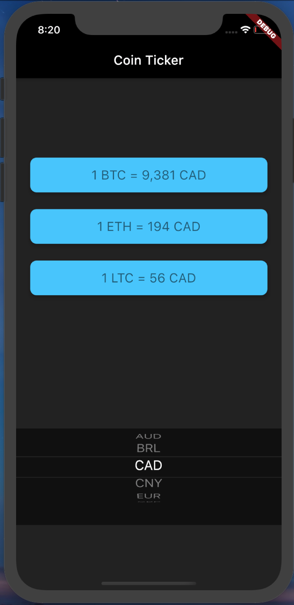

# Bitcoin Ticker 

## 
 providing a different user interface depending on the platform.

## What you will create

making a crypto currency price checking app. 

  

## 

- How to use the DropdownButton Widget from Material design.
- How to loop through code using Dart for and for-in loops.
- How to use Cupertino Widgets in your app.
- How to check the platform your app is being run on to customise the UI for that platform.
- Revise previous concepts by completing the challenges.

>This is a companion project to The App Brewery's Complete Flutter Development Bootcamp [www.appbrewery.co](https://www.appbrewery.co/)
